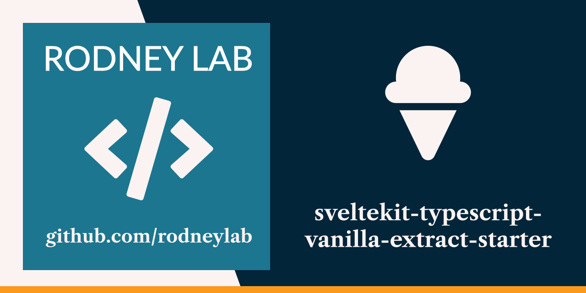

<p align="center">
  <a aria-label="Open Rodney Lab site" href="https://rodneylab.com" rel="nofollow noopener noreferrer">
    
  </a>
</p>
<h1 align="center">
  SvelteKit TypeScript vanilla-extract Starter
</h1>

# sveltekit-typescript-vanilla-extract-starter

[](https://stackblitz.com/github/rodneylab/sveltekit-typescript-vanilla-extract-starter)

Starter for a vanila-extract SvelteKit blog using TypeScript, mdsvex and
Iconify. There is more detail in the
<a aria-label="Open Rodney Lab blog post on Svelte Kit Shiki syntax highlighting" href="https://rodneylab.com/sveltekit-typescript-vanilla-extract-starter/">post
on introducing the SvelteKit TypeScript vanilla-extract starter</a>. If you have
any questions, please drop a comment at the bottom of that page.

## Building and previewing the site

If you're seeing this, you've probably already done this step. Congrats!

```bash
git clone https://github.com/rodneylab/sveltekit-typescript-vanilla-extract-starter.git
cd sveltekit-typescript-vanilla-extract-starter
pnpm install # or npm install
pnpm run dev
```

## Building

```bash
pnpm run build
```

> You can preview the built app with `pnpm run preview`, regardless of whether
> you installed an adapter. This should _not_ be used to serve your app in
> production.

Feel free to jump into the
[Rodney Lab matrix chat room](https://matrix.to/#/%23rodney:matrix.org).
